KCIDB-Grafana
=============
KCIDB-Grafana is a collection of documentation/scripts/data files needed to
setup and maintain an instance of [Grafana](https://grafana.com/) displaying
[Linux Kernel CI reports](https://staging.kernelci.org:3000/) stored in a
[KCIDB](https://github.com/kernelci/kcidb/) database.

Write to [kernelci@groups.io](mailto:kernelci@groups.io) if you want to start
submitting results from your CI system, or if you want to receive automatic
notifications of arriving results.

Architecture
------------

The current setup on [staging.kernelci.org](https://staging.kernelci.org:3000)
is implemented with a tweaked, but stock Grafana container, exposing port 3000
on localhost, and a Nginx configuration forwarding HTTPS connections on
outside port 3000 to it.

Grafana is configured with the following.

* BigQuery data source using a Google JWT file for authenticating to the KCIDB
  dataset with US as the processing location.
* A number of dashboards displaying various objects in the database, with one
  of them ("Home") set as the home dashboard.
* Anonymous access enabled.

Setup
-----
To create and start a Grafana container run:

    docker-compose up -d

For development setup, remember to adjust or drop the GF_SERVER_DOMAIN
and GF_SERVER_HTTP_PORT environment variables in `docker-compose.yml`.

Login as an administrator (default credentials are `admin`/`admin`).

### Data Source

Add BigQuery datasource, following the steps below.

1. Click "⚙️"->"Data Sources".

   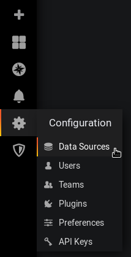

2. Click the "Add data source" button.

   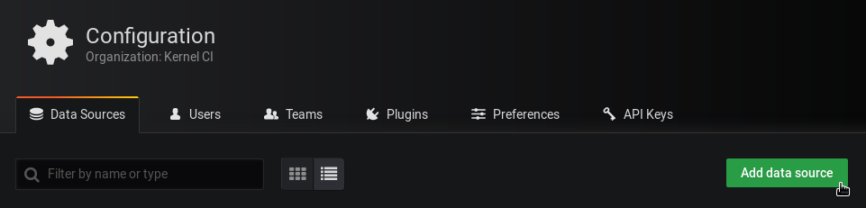

3. Search for and select the "BigQuery" data source type.

   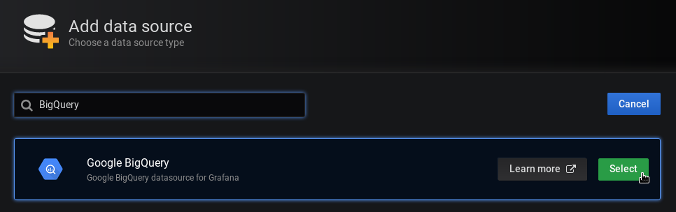

4. Set the name of the data source to "Google BigQuery" (the default), and
   optionally make it the default datasource.

   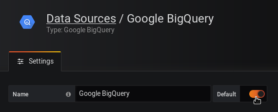

5. Upload Google Cloud Service Account key file. Grafana account will need
   "BigQuery Data Viewer" and "BigQuery Job User" roles only.

   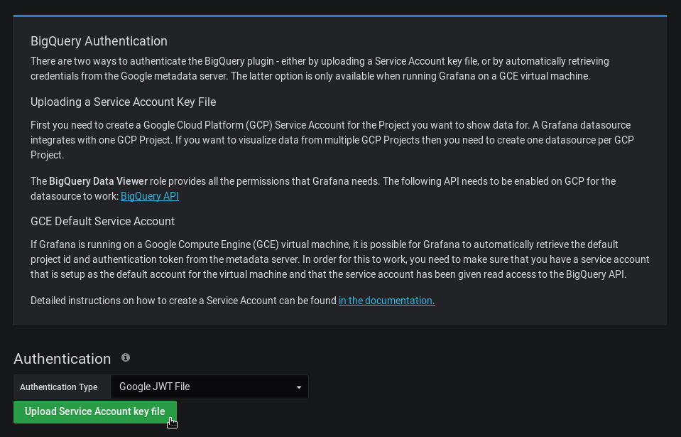

6. Select processing location appropriate for your dataset (US for Kernel CI
   data currently).

   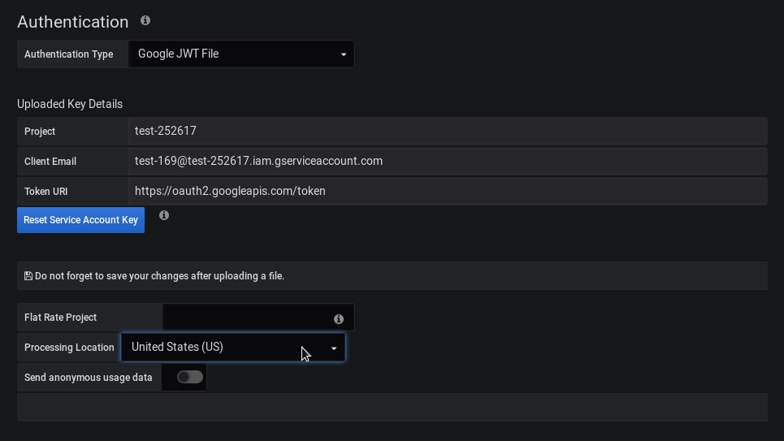

7. Click the "Save & Test" button.

   

8. Verify the test was a success.

   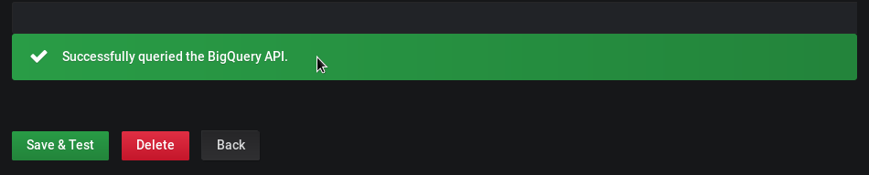

### Dashboards

Import each of the dashboards from this repository, following the steps below.

1. Click "+"->"Import".

   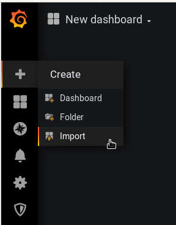

2. Click "Upload .json file", select dashboard file.

   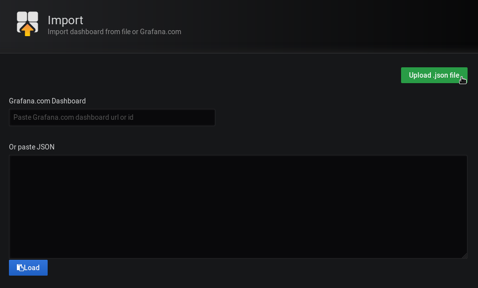

3. Do not change properties, unless you know what you're doing.

   

Development
-----------
To update dashboard files in this repository, export and overwrite each of
them, following the steps below.

1. Click "Share dashboard".

   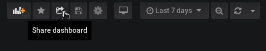

2. Click "Export", and then "Save to file".

   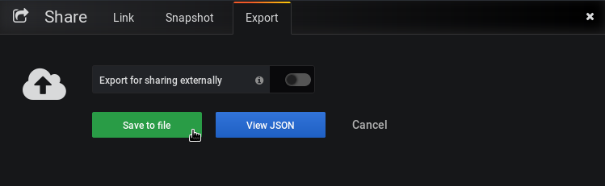
